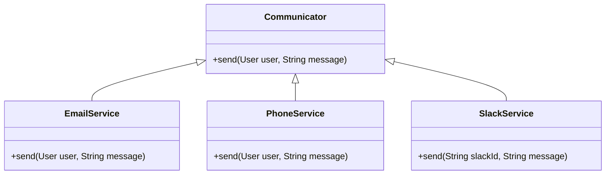
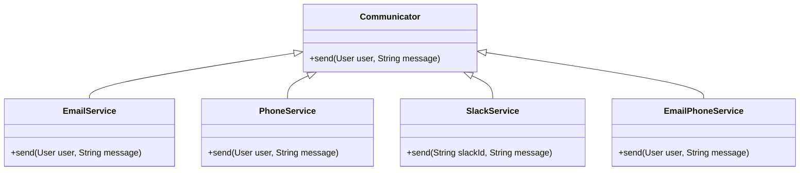

# Decorator
## Decorator

The Decorator attaches additional responsibilities to an object dynamically. The ornaments that are added to pine or fir trees are examples of Decorators. Lights, garland, candy canes, glass ornaments, etc., can be added to a tree to give it a festive look. The ornaments do not change the tree itself which is recognizable as a Christmas tree regardless of particular ornaments used. As an example of additional functionality, the addition of lights allows one to "light up" a Christmas tree.

Another example: assault gun is a deadly weapon on its own. But you can apply certain "decorations" to make it more accurate, silent and devastating.


### Problem
Let us say we want to build a class that sends our users emails with a greeting. We can start with a simple class:

```java
public class EmailService {
    public void sendEmail(User user, String message) {
        ...
    }
}
```

As the application grows we may want to add some additional functionality to our email service. For example, we may want to send phone notifications to our users or send them Slack messages. We can obviously add new methods to our EmailService class, but this will violate the Single Responsibility Principle. So we do as we always do and abstract the functionality into a separate class:

```java
public interface Communicator {
    void send(User user, String message);
}
```

Now we have the following hierarchy:



The above hierarchy is fine, but what if we want to send emails to our users and also send them a phone notification? We can use the separate classes, but this will violate the Open-Closed Principle. We can't extend the functionality of our EmailService class, because it is final. So we need to create a new class that will encapsulate the functionality of the EmailService and the PhoneService classes:



The above approach is extremely brittle. If we want to add a new functionality, we will have to create a new class for each combination of existing functionalities. It also leads to class explosion. The number of classes grows exponentially with the number of possible combinations of functionalities.

### Solution

The problem with the above approach is that inheritance is static. We can't add new functionality to an existing class at runtime. Apart from that multiple inheritance is not supported in a lot of languages and hence to create a new class that encapsulates the functionality of multiple existing classes we have to duplicate the code of the existing classes.

Another option is to use composition. We can create a new class that will contain references to the existing classes and delegate the calls to the existing classes. This where the Decorator pattern comes in. **The Decorator pattern allows us to add new functionality to an existing object without altering its structure.** The Decorator pattern is also known as Wrapper.

A wrapper is an object that can be linked with some target object. The wrapper contains the same set of methods as the target and delegates to it all requests it receives. However, the wrapper may alter the result by doing something either before or after it passes the request to the target. The wrapper implements the same interface as the wrapped object.

The Decorator pattern is implemented with the following steps:
1. `Common product interface` - Declare the common interface for both wrappers and wrapped objects.
```java
public interface Communicator {
    void send(User user, String message);
}
```

2. `Concrete product` - Create a concrete product class that implements the common interface and represents the basic behavior of the wrapped object.
```java
public class EmailService implements Communicator {
    @Override
    public void send(User user, String message) {
        ...
    }
}
```

3. `Base decorator` - Create a base decorator class that implements the common interface and contains a field for storing a reference to a wrapped object.

```java
public abstract class CommunicatorDecorator implements Communicator {
    protected Communicator communicator;

    public CommunicatorDecorator(Communicator communicator) {
        this.communicator = communicator;
    }
}
```

4. `Concrete decorators` - Create concrete decorator classes that extend the base decorator class and add additional behavior to the wrapped object.

```java
public class PhoneServiceDecorator extends CommunicatorDecorator {
    public PhoneService(Communicator communicator) {
        super(communicator);
    }

    @Override
    public void send(User user, String message) {
        communicator.send(user, message);
        sendPhoneNotification(user, message);
    }

    private void sendPhoneNotification(User user, String message) {
        ...
    }
}
```

5. `Client` - The client code works with all objects using the common interface. This way it can stay independent of the concrete classes of objects it works with.

```java
public class Client {
    public static void main(String[] args) {
        User user = new User("abc@g.com",342342333);
        Communicator communicator = new EmailService();
        Communicator phoneService = new PhoneServiceDecorator(communicator);
        Communicator slackService = new SlackServiceDecorator(phoneService);
        slackService.send(user, "Hello");
    }
}
```

### Advantages
* Object behavior can be extended at runtime by wrapping an object with one or several decorators without creating a new subclass.
* Runtime configuration of an object is possible.
* New behavior can be added to an object without changing its code.
* SRP is respected by encapsulating the behavior in a separate class.